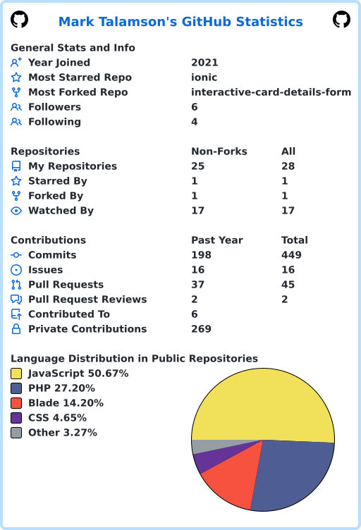

<picture data-importer="pacman">
  <source media="(prefers-color-scheme: dark)" srcset="https://raw.githubusercontent.com/emtee-1023/emtee-1023/pacman-output/pacman-contribution-graph-dark.svg?game=pacman">
  <source media="(prefers-color-scheme: light)" srcset="https://raw.githubusercontent.com/emtee-1023/emtee-1023/pacman-output/pacman-contribution-graph.svg?game=pacman">
  
</picture>

# Hi there 👋, I'm Mark Talamson

### Mobile Developer | Machine Learning Enthusiast | Embedded Systems Builder

I'm a software developer from Kenya passionate about building technology that solves real-world problems.

🔭 Currently working on **Q-Cash**, an Early Revenue Access platform for informal SMEs that combines:
- Flutter mobile applications
- Laravel backend APIs
- Machine Learning for revenue prediction and risk assessment
- USSD services through Africa's Talking
- PostgreSQL databases

🌱 Currently learning and exploring:
- Advanced Machine Learning
- Financial Technology (FinTech)
- Embedded Systems with ESP32
- MLOps and Model Deployment
- Scalable Backend Architecture

---

## 🚀 Tech Stack

### 📱 Mobile Development
Flutter & Dart

  

---

### 🧠 Backend Development
Laravel & PHP

  

---

### 🤖 Machine Learning & Data Science
Python, TensorFlow & PyTorch

  

---

### 🗄️ Databases
PostgreSQL, MySQL & SQLite

  

---

### 🔌 Embedded Systems & IoT
Arduino, Raspberry Pi & Python

  

---

### 🛠️ Tools & DevOps
Git, GitHub, Linux, VS Code & Docker

  

## 💡 Featured Project

### Q-Cash
A machine learning-powered Early Revenue Access platform designed for Kenya's informal SMEs.

**Key Features**
- Revenue prediction using Random Forest Regression
- Credit risk assessment using Random Forest Classification
- Mobile application for business owners
- USSD support for accessibility
- Data-driven lending decisions

---

## 📊 GitHub Stats

  

  
  

  
  
  

---

## 🎯 Current Goals

- Build impactful FinTech solutions for Africa
- Improve ML model deployment skills
- Contribute to open-source projects
- Explore IoT and embedded systems applications
- Grow as a full-stack engineer

---

## 📫 Let's Connect

- LinkedIn: www.linkedin.com/in/mark-talamson-a1aab1350
- Email: mailto:marktalamson@gmail.com

> "Building technology that creates opportunities where traditional systems fall short."
